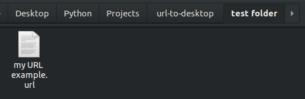
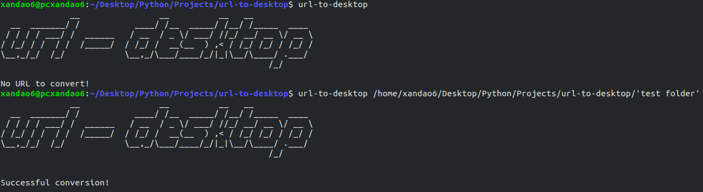
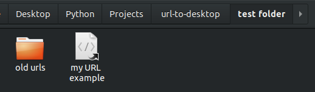

<br />
<p align="center">
  <h3 align="center">URL to Desktop</h3>

  <p align="center">
    It is a command line software through which you can convert .url files, used in Windows, into .desktop files used in linux.
    <br />
	<br />
    <a href="https://github.com/xandao6/url-to-desktop"><strong>Explore the docs »</strong></a>
    <br />
    <a href="https://github.com/xandao6/url-to-desktop/issue">Report Bug</a>
    ·
    <a href="https://github.com/xandao6/url-to-desktop/issues">Request Feature</a>
  </p>
</p>


<!-- TABLE OF CONTENTS -->
<details open="open">
  <summary>Table of Contents</summary>
  <ol>
    <li>
      <a href="#about-the-project">About The Project</a>
      <ul>
        <li><a href="#features">Features</a></li>
        <li><a href="#built-with">Built With</a></li>
      </ul>
    </li>
    <li>
      <a href="#getting-started">Getting Started</a>
      <ul>
        <li><a href="#installation">Installation</a></li>
      </ul>
    </li>
    <li><a href="#usage">Usage</a></li>
    <li><a href="#roadmap">Roadmap</a></li>
    <li><a href="#contributing">Contributing</a></li>
    <li><a href="#license">License</a></li>
    <li><a href="#contact">Contact</a></li>
  </ol>
</details>


<!-- ABOUT THE PROJECT -->
## About The Project

<div align="center">
  <a href="https://github.com/xandao6/url-to-desktop">
    <br>
	<br>
	<br>
  </a>
</div>

### Features

* Convert .url files to .desktop files
* ~~Convert .desktop files to .url files~~ (not yet implemented)

### Built With

* [Python 3](https://www.python.org/) - High-level programming language
* [Fire](https://github.com/google/python-fire) - Auto generate CLI

## Getting Started

### Installation

url-to-desktop is available on [PyPI](https://pypi.org/project/url-to-desktop/). You can install it by pip command: 

```bash
pip3 install url-to-desktop
```

## Usage

* To convert in the current directory 
	```bash
	url-to-desktop
	```
* To convert in a specific directory
	```bash 
	url-to-desktop /path/
	```

## Roadmap

See the [open issues](https://github.com/xandao6/url-to-desktop/issues) for a list of proposed features (and known issues).

## Contributing

Contributions are what make the open source community such an amazing place to be learn, inspire, and create. Any contributions you make are **greatly appreciated**.

1. Fork the Project
2. Create your Feature Branch (`git checkout -b feature/AmazingFeature`)
3. Commit your Changes (`git commit -m 'Add some AmazingFeature'`)
4. Push to the Branch (`git push origin feature/AmazingFeature`)
5. Open a Pull Request

<!-- LICENSE -->
## License

Distributed under the MIT License. See [LICENSE](./LICENSE.md) for more information.

Free software =)

<!-- CONTACT -->
## Contact

Alexandre Calil - [@xandao6](https://www.linkedin.com/in/xandao6/) - alexandrecalilmf@gmail.com

Project Link: [https://github.com/xandao6/url-to-desktop](https://github.com/xandao6/url-to-desktop)
